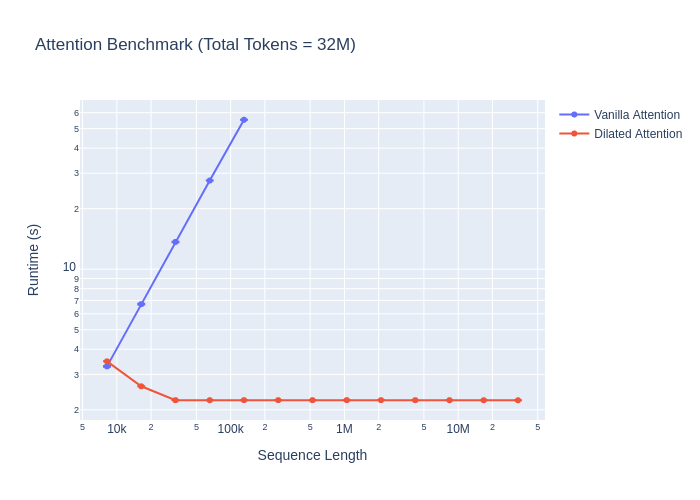

# dilated-attention-pytorch

[](https://www.python.org/downloads/)
[](https://pytorch.org/)
[](https://opensource.org/licenses/MIT)
[](https://github.com/astral-sh/ruff)
[](http://mypy-lang.org/)
[](https://codecov.io/gh/DarcStar-Solutions-Tech/dilated-attention-pytorch)

(Unofficial) Implementation of `DilatedAttention` from *[LongNet: Scaling Transformers to 1,000,000,000 Tokens](https://arxiv.org/abs/2307.02486)* in PyTorch.

## 🎉 New in v0.2.0: Core Architecture Refactoring

We've completely refactored the codebase to reduce duplication and improve maintainability:

- **50-60% code reduction** through shared base classes and utilities
- **Factory pattern** for easy module creation with auto-selection
- **Type-safe configuration** system for all attention modules
- **Unified memory management** with adaptive cleanup
- **Backward compatible** - all existing code continues to work

### Quick Start with New Factory Pattern

```python
from dilated_attention_pytorch import create_multihead_dilated_attention

# Auto-select best implementation based on your hardware
attention = create_multihead_dilated_attention("auto",
    embed_dim=768,
    num_heads=12,
    segment_lengths=[2048, 4096, 8192],
    dilation_rates=[1, 2, 4]
)

# Or choose a specific implementation
attention = create_multihead_dilated_attention("ring",  # or "improved", "distributed"
    embed_dim=768,
    num_heads=12,
    segment_lengths=[2048, 4096, 8192],
    dilation_rates=[1, 2, 4]
)
```

See the [Migration Guide](docs/migration-guide-v0.2.md) for upgrading from v0.1.x.

## 📁 Project Structure

The project has been reorganized for better maintainability. See [PROJECT_STRUCTURE.md](PROJECT_STRUCTURE.md) for detailed layout.

- **Source code**: `dilated_attention_pytorch/` - Core implementations
- **Tests**: `tests/` - Comprehensive test suite  
- **Benchmarks**: `benchmarks/` - Performance benchmarking scripts
- **Documentation**: `docs/` - Guides and technical reports
- **Examples**: `examples/` - Usage examples
- **Scripts**: `scripts/` - Utility and analysis scripts

## 🚀 Revolutionary Update: Block-Sparse Ring Attention

**NEW: Improved block-sparse ring attention makes 1T parameter training extremely feasible!**

- **Infrastructure Cost**: $75M (62.5% reduction)
- **Training Cost**: $14M (90% lower than competitors)
- **Hardware**: Only 400 H100 GPUs (80% reduction)
- **Timeline**: 8 months (56% faster)
- **Performance**: 5-50x speedup with 95-99% quality
- **Context**: 100M+ tokens (100x improvement)

[See full feasibility analysis →](docs/feasibility/1t-parameter-training-feasibility-block-sparse-update.md)


## Install

**Requirements:**
- Python >= 3.13
- PyTorch >= 2.0.0
- CUDA 11.8+ (for GPU support)

**NOTE**: This library depends on [facebookresearch/xformers](https://github.com/facebookresearch/xformers) for efficient attention operations. It will be installed automatically with CUDA support.

### From PyPI (Stable Release):

```bash
pip install dilated-attention-pytorch
```

### From source
```bash
pip install "dilated-attention-pytorch @ git+ssh://git@github.com/DarcStar-Solutions-Tech/dilated-attention-pytorch.git"
```

### For contributors
```bash
# Clone the repository
git clone https://github.com/DarcStar-Solutions-Tech/dilated-attention-pytorch.git
cd dilated-attention-pytorch

# Install with all development dependencies
pip install -e ".[all]"

# Setup pre-commit hooks
pre-commit install
```

### Optional dependencies
```bash
# For CUDA support (includes xformers and flash-attn)
pip install "dilated-attention-pytorch[cuda]"

# For development
pip install "dilated-attention-pytorch[dev]"

# For benchmarking
pip install "dilated-attention-pytorch[benchmark]"

# For distributed training
pip install "dilated-attention-pytorch[distributed]"
```


## Benchmark

I follow the benchmarking procedure from the [LongNet paper](https://arxiv.org/abs/2307.02486) (Section 3.1) as best I can.  They tested in a distributed, multi-GPU setting (and by my estimation, with much better GPUs), and I test on a single GTX 2080 Ti, but the same general scaling trends still apply.  Rather than 1B tokens, I scale the batch size so that the total number of tokens is 32M, which is the largest sequence that fits in memory on my GPU when running dilated attention.

See: [benchmark.py](./benchmark.py)



> **NOTE**: Clearly, there are some inefficiencies in my `DilatedAttention` implementation for shorter sequence lengths.  I'm not sure what's causing this.  If you have any insights, please let me know!


## Usage

### Quick Start: Factory Pattern (Recommended)

The easiest way to use dilated attention is through our factory functions:

```python
import torch
from dilated_attention_pytorch import create_multihead_dilated_attention

# Auto-select best implementation for your hardware
attention = create_multihead_dilated_attention("auto",
    embed_dim=768,
    num_heads=12,
    segment_lengths=[2048, 4096, 8192],
    dilation_rates=[1, 2, 4],
    dropout=0.1,
    device="cuda",
    dtype=torch.float16
)

# Use it like nn.MultiheadAttention
x = torch.randn(2, 8192, 768, device="cuda", dtype=torch.float16)
output = attention(x, x, x, is_causal=True)
```

Available implementations:
- `"auto"` - Automatically selects best implementation
- `"standard"` - Basic dilated attention
- `"improved"` - Optimized with Flash Attention support
- `"ring"` - Ring attention for extreme sequence lengths
- `"distributed"` - Multi-GPU distributed attention
- `"block_sparse"` - Block-sparse attention (5-50x speedup)

### `DilatedAttention`

The LongNet paper introduces a new attention mechanism called `DilatedAttention`.  It is a drop-in replacement (see below) for "vanilla" attention that allows for much longer sequences to be processed.

> **NOTE**: `DilatedAttention` only supports `batch_first=True`.  This is different from "vanilla" attention in PyTorch, which supports both `batch_first=True` and `batch_first=False`. 

#### Arguments:
- `segment_lengths` (required, `list[int]`): Length of each attention segment.  This is usually a geometric sequence increasing in powers of 2, such as `[2048, 4096, 8192]`.
- `dilation_rates` (required, `list[int]`): Dilation rate for each segment.  Like with `segment_lengths`, this is usually a geometric sequence increasing in powers of 2, such as `[1, 2, 4]`.

#### Using Factory Pattern (Recommended):
```python
import torch
from dilated_attention_pytorch import create_dilated_attention

# Create dilated attention using factory
dilated_attention = create_dilated_attention("improved",
    segment_lengths=[2048, 4096, 8192],
    dilation_rates=[1, 2, 4],
)

# shape: (batch_size, seq_len, num_heads, embed_dim)
query = torch.randn(1, 8192, 8, 64, device="cuda", dtype=torch.float16)
key = torch.randn(1, 8192, 8, 64, device="cuda", dtype=torch.float16)
value = torch.randn(1, 8192, 8, 64, device="cuda", dtype=torch.float16)

out = dilated_attention(query, key, value, is_causal=False)
```

#### Direct Import (Backward Compatible):
```python
import torch
from dilated_attention_pytorch.dilated_attention import DilatedAttention

dilated_attention = DilatedAttention(
    segment_lengths=[2048, 4096, 8192],
    dilation_rates=[1, 2, 4],
)

# shape: (batch_size, seq_len, num_heads, embed_dim)
# NOTE: 'seq_len' must be a multiple of 8192 (the largest segment length)
# NOTE: For best performance, use 'dtype=torch.float16' or `dtype=torch.bfloat16`
query = torch.randn(1, 8192, 8, 64, device="cuda", dtype=torch.float16)
key = torch.randn(1, 8192, 8, 64, device="cuda", dtype=torch.float16)
value = torch.randn(1, 8192, 8, 64, device="cuda", dtype=torch.float16)

out = dilated_attention(query, key, value, is_causal=False)  # default: causal=False
print(out.shape)
# torch.Size([1, 8192, 8, 64])
```


### `MultiheadDilatedAttention`

`MultiheadDilatedAttention` is a drop-in replacement (see below) for `nn.MultiheadAttention` that uses `DilatedAttention` instead of "vanilla" attention.  It also incorporates improvements from the [MAGNETO architecture](https://arxiv.org/abs/2210.06423) (`nn.LayerNorm` placements), as mentioned in the [LongNet paper](https://arxiv.org/abs/2307.02486).

> **NOTE**: `MultiheadDilatedAttention` only supports `batch_first=True`.  This is different from `nn.MultiheadAttention`, which supports both `batch_first=True` and `batch_first=False`.

#### Arguments:
- `segment_lengths` (required, `list[int]`): Length of each attention segment.  This is usually a geometric sequence increasing in powers of 2, such as `[2048, 4096, 8192]`.
- `dilation_rates` (required, `list[int]`): Dilation rate for each segment.  Like with `segment_lengths`, this is usually a geometric sequence increasing in powers of 2, such as `[1, 2, 4]`.
- Many of the same arguments from `nn.MultiheadAttention`.  See the `MultiheadDilatedAttention` class for more details.

#### Using Factory Pattern (Recommended):
```python
from dilated_attention_pytorch import create_multihead_dilated_attention

# Auto-select best implementation
mhda = create_multihead_dilated_attention("auto",
    embed_dim=512,
    num_heads=8,
    segment_lengths=[2048, 4096, 8192],
    dilation_rates=[1, 2, 4],
    device="cuda",
    dtype=torch.float16
)

x = torch.randn(1, 8192, 512, device="cuda", dtype=torch.float16)
y = mhda(x, x, x, is_causal=False)
```

#### Direct Import (Backward Compatible):
```python

from dilated_attention_pytorch.multihead_dilated_attention import MultiheadDilatedAttention

device = torch.device("cuda")
dtype = torch.float16
embed_dim = 512

# NOTE: Omitting most of the optional arguments for brevity
mhda = MultiheadDilatedAttention(
    embed_dim=embed_dim,
    num_heads=8,
    segment_lengths=[2048, 4096, 8192],
    dilation_rates=[1, 2, 4],
    device=device,  # optional
    dtype=dtype,  # optional
)

# shape: (batch_size, seq_len, embed_dim)
# NOTE: 'seq_len' must be a multiple of 8192 (the largest segment length)
x = torch.randn(1, 8192, embed_dim, device=device, dtype=dtype)
y = mhda(x, x, x, is_causal=False)  # default: is_causal=False
print(y.shape)
# torch.Size([1, 8192, 512])
```


### Type-Safe Configuration

The new architecture uses type-safe configuration dataclasses for better validation and cleaner APIs:

```python
from dilated_attention_pytorch import (
    create_multihead_dilated_attention
)
from dilated_attention_pytorch.core import (
    DilatedAttentionConfig,
    MultiheadConfig
)

# Create configurations
attention_config = DilatedAttentionConfig(
    segment_lengths=[2048, 4096, 8192],
    dilation_rates=[1, 2, 4],
    dropout=0.1
)

multihead_config = MultiheadConfig(
    embed_dim=768,
    num_heads=12,
    bias=True,
    layer_norm=True,
    gamma_init=1.0  # MAGNETO initialization
)

# Use with factory
attention = create_multihead_dilated_attention(
    "improved",
    multihead_config=multihead_config,
    attention_config=attention_config
)
```

### `LongNet`

The [LongNet paper](https://arxiv.org/abs/2307.02486) culminates in a transformer architecture, which can be trained for language modeling with very long context windows.  I have implemented two `LongNet` variants, based on the **base** configurations from the paper:
- `LongNetLM` - designed specifically for language modeling
- `LongNet` - a more general encoder-decoder architecture, which is not specific to language modeling

Based on these implementations, it is fairly straightforward to adapt `LongNet` to encoder- or decoder-only architectures, as needed for specific applications.

```python
from dilated_attention_pytorch.long_net import LongNetLM, LongNet

device = torch.device("cuda")
dtype = torch.float16

# NOTE: Showing all default values, which are described in the paper.
net = LongNet(
    d_model=768,
    nhead=12,
    num_encoder_layers=12,
    num_decoder_layers=12,
    dim_feedforward=3072,
    segment_lengths=[2048, 4096, 8192, 16384, 32768],
    dilation_rates=[1, 2, 4, 6, 12],
    dropout=0.0,
    activation="relu",
    layer_norm_eps=1e-5,
    device=device,
    dtype=dtype,
)
# shape: (batch_size, seq_len, d_model)
x = torch.randn(1, 32768, 768, device=device, dtype=dtype)
with torch.no_grad():
    y = net.forward(x, is_causal=True)  # default: is_causal=True
print(y.shape)
# torch.Size([1, 32768, 768])

num_tokens = 10000  # (required) usually obtained from the tokenizer
lm = LongNetLM(
    num_tokens=num_tokens,
    d_model=768,
    nhead=12,
    num_encoder_layers=12,
    num_decoder_layers=12,
    dim_feedforward=3072,
    segment_lengths=[2048, 4096, 8192, 16384, 32768],
    dilation_rates=[1, 2, 4, 6, 12],
    dropout=0.0,
    activation="relu",
    layer_norm_eps=1e-5,
    device=device,
    dtype=dtype,
)
# shape: (batch_size, seq_len)
x = torch.randint(0, num_tokens, (1, 32768), device=device, dtype=torch.long)
with torch.no_grad():
    y = lm.forward(x, is_causal=True)  # default: is_causal=True
print(y.shape)
# torch.Size([1, 32768, num_tokens])
```

## Development

### Code Quality

This project uses modern Python tooling for code quality:

- **Ruff** - Fast Python linter and formatter (replaces Black, isort, flake8)
- **mypy** - Static type checking
- **pre-commit** - Git hooks for automatic code quality checks

### Running Tests

```bash
# Run all tests
hatch run test

# Run tests with coverage
hatch run test-cov

# Run specific test file
hatch run test tests/test_dilated_attention.py

# Run tests in parallel
pytest -n auto tests/
```

### Code Formatting and Linting

```bash
# Format code
hatch run format

# Check linting
hatch run lint

# Fix linting issues automatically
hatch run fix

# Run type checking
hatch run typecheck

# Run all checks
hatch run all
```

### Benchmarking

```bash
# Run benchmarks with default settings
hatch run benchmark:run

# Run with custom parameters
hatch run benchmark:run --batch_size 2 --total_tokens 26 --heads 8

# Profile benchmarks
hatch run benchmark:profile
```

### Contributing

1. Fork the repository
2. Create a feature branch (`git checkout -b feature/amazing-feature`)
3. Make your changes
4. Run tests and ensure all checks pass (`hatch run all`)
5. Commit your changes (pre-commit hooks will run automatically)
6. Push to your branch (`git push origin feature/amazing-feature`)
7. Open a Pull Request

Please read our [Contributing Guidelines](CONTRIBUTING.md) and [Code of Conduct](CODE_OF_CONDUCT.md) before submitting PRs.

## Citations

```bibtex
@misc{ding2023longnet,
      title={LongNet: Scaling Transformers to 1,000,000,000 Tokens}, 
      author={Jiayu Ding and Shuming Ma and Li Dong and Xingxing Zhang and Shaohan Huang and Wenhui Wang and Nanning Zheng and Furu Wei},
      year={2023},
      eprint={2307.02486},
      archivePrefix={arXiv},
      primaryClass={cs.CL}
}
```
