# Ring Attention Dependency Graph

**Date**: 2025-07-06-1459-UTC  
**Purpose**: Visualize the complex relationships between ring attention implementations

## Implementation Hierarchy

```mermaid
graph TB
    %% Core utilities
    subgraph "Core Utilities"
        RU[ring_attention_utils.py]
        RLSE[ring_attention_lse.py]
        RLSEO[ring_attention_lse_optimized.py]
        RB[ring_attention_bucketed.py]
    end
    
    %% Base implementations
    subgraph "Base Implementations"
        RDF[ring_dilated_attention_fixed.py]
        RDR[ring_dilated_attention_refactored.py]
        RDP[ring_dilated_attention_production.py]
        RDV3[ring_dilated_attention_v3.py]
        RDT[ring_dilated_attention_true.py]
    end
    
    %% Hilbert variants
    subgraph "Hilbert Variants"
        RDHF[ring_dilated_attention_hilbert_fixed.py]
        RDHO[ring_dilated_attention_hilbert_optimized.py]
        RDHOF[ring_dilated_attention_hilbert_optimized_fixed.py]
        RDHOP[ring_dilated_attention_hilbert_optimized_proper.py]
        RDHR[ring_dilated_attention_hilbert_refactored.py]
        RDHV2[ring_dilated_attention_hilbert_v2.py]
    end
    
    %% Hybrid variants
    subgraph "Hybrid Variants"
        RDH[ring_dilated_attention_hybrid.py]
        RDHFIX[ring_dilated_attention_hybrid_fixed.py]
        RDHO[ring_dilated_attention_hybrid_optimized.py]
        RDHOV2[ring_dilated_attention_hybrid_optimized_v2.py]
        RDHOV2R[ring_dilated_attention_hybrid_optimized_v2_refactored.py]
        RDHH[ring_dilated_attention_hybrid_hilbert.py]
    end
    
    %% Triton variants
    subgraph "Triton Variants"
        RDST[ring_dilated_attention_simple_triton.py]
        RDTI[ring_dilated_attention_triton_integrated.py]
        RDTK[ring_dilated_attention_triton_kernel.py]
        RDTO[ring_dilated_attention_triton_optimized.py]
    end
    
    %% Distributed
    subgraph "Distributed"
        RDD[ring_distributed_dilated_attention.py]
    end
    
    %% Multihead wrappers
    subgraph "Multihead Wrappers"
        RMDH[ring_multihead_dilated_attention_hybrid.py]
    end
    
    %% Dependencies
    RU --> RDF
    RU --> RDH
    RU --> RDV3
    RLSE --> RDF
    RLSE --> RDH
    RLSE --> RDV3
    
    RDF --> RDHF
    RDHOV2 --> RDHOP
    RDHOV2 --> RDHV2
    RDHOV2 --> RDHH
    RDR --> RDHOV2R
    
    RDH --> RMDH
```



## Active vs Deprecated Implementations

### Currently Exposed in `__init__.py`:
1. **RingDilatedAttentionProduction** - Main production implementation
2. **RingDilatedAttentionHybrid** - Best of V2 and V3
3. **RingDilatedAttentionHilbertOptimized** - Hilbert ordering optimization
4. **RingMultiheadDilatedAttentionHybrid** - Multihead wrapper

### Aliases:
- **RingDilatedAttentionTrue** → RingDilatedAttentionHybrid

### Not Exposed (Potentially Dead Code):
All other implementations listed above

## Inheritance Relationships

```
nn.Module
├── RingDilatedAttentionFixed
│   └── RingDilatedAttentionHilbertFixed
├── RingDilatedAttentionRefactored
│   └── RingDilatedAttentionHybridOptimizedV2Refactored
├── RingDilatedAttentionHybridOptimizedV2
│   ├── RingDilatedAttentionHilbertOptimizedProper
│   ├── RingDilatedAttentionHilbertV2
│   └── RingDilatedAttentionHybridHilbert
└── [Other standalone implementations]
```

## Common Dependencies

### External Dependencies:
- `torch.nn.Module` - Base class for all implementations
- `torch.distributed` - For multi-GPU support
- Flash Attention (optional) - For optimized attention computation
- Triton (optional) - For custom kernels

### Internal Shared Utilities:
1. **ring_attention_utils.py**:
   - `all_ring_pass()` - Ring communication
   - `split_by_rank()` - Data partitioning
   - `RingInfo` - Configuration dataclass

2. **ring_attention_lse.py**:
   - `StableRingAccumulator` - Numerical stability
   - `compute_attention_with_lse()` - LSE computation

3. **Memory Pool** (from core/):
   - Used by hybrid implementations
   - Not used by "fixed" implementations

4. **Pattern Cache** (from core/):
   - Used by optimized variants
   - Not used by simple implementations

## Refactoring Recommendations

### 1. Create Clear Hierarchy:
```
ring_attention/
├── base.py                    # Abstract base class
├── implementations/
│   ├── production.py         # Main implementation
│   ├── hilbert.py           # Hilbert optimization
│   └── distributed.py       # Multi-GPU support
├── kernels/
│   ├── pytorch.py           # Pure PyTorch
│   └── triton.py           # Triton kernels
└── multihead.py             # Multihead wrapper
```

### 2. Consolidation Strategy:
- Merge all "fixed" variants into main implementations
- Combine V2, V3, and hybrid into single best implementation
- Extract Hilbert ordering as a mixin or decorator
- Unify Triton kernels into single module

### 3. Migration Path:
1. Keep current exports for backward compatibility
2. Add deprecation warnings to old implementations
3. Update internal usage to new structure
4. Remove deprecated code in next major version